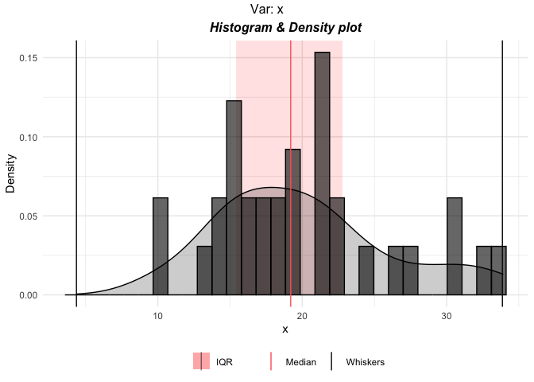
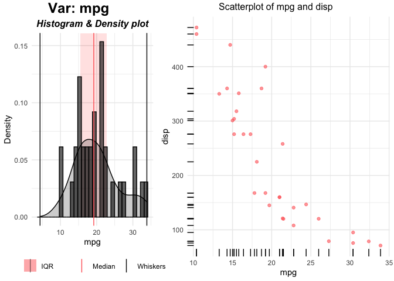
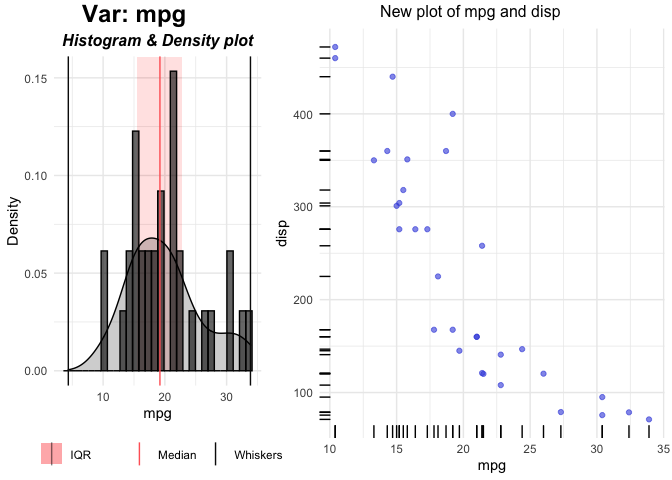
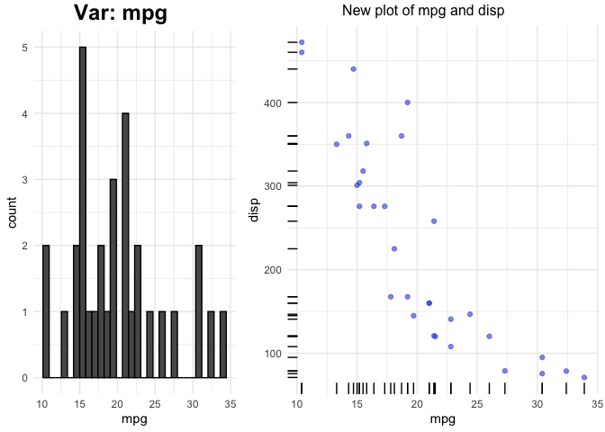

<!-- README.md is generated from README.Rmd. Please edit that file -->

# analyzer

<!-- badges: start -->

<!-- badges: end -->

The goal of analyzer is to make data analysis easy and accessible to
everyone by automatically performing the common tasks involved in data
analysis. With one command this can also create an R notebook (.rmd)
file and convert it into html or pdf file. The notebooks can also be
made interactive.

``` r
library(analyzer)
library(ggplot2)
```

## Example - Notebook

This is a basic example which shows how to solve a common problem. By
running the following command a notebook can be generated:

``` r
GenerateReport(dtpath = "mtcars.csv",
               catVars = c("cyl", "vs", "am", "gear"),
               yvar = "vs", model = "binClass",
               output_format = 'html_document',
               title = "Report", 
               output_dir = "~/Documents/temp",
               interactive.plots = FALSE)
```

In the above command we are asking to generate an HTML file
(output\_format = ‘html\_document’) for the data **mtcars.csv** stored
in the working directory (dtpath = “mtcars.csv”). We defined the
variables (“cyl”, “vs”, “am”, “gear”) as categorical through the
parameter ‘catVars’ and variable “vs” as the dependent variable.

For more details on other parameters, look into the help of
**GenerateReport** function. The generated notebook will have all the
relevant code snippents for this particular data along with the outputs.
The notebook can be used as a reference and modified as required.

## Example - Plots

**analyzer** can also be used to automatically generate plots for all
the columns in the data. If the data has a dependent (response) variable
pass it through the **yvar** argument and its type through **yclass**
argument.

``` r
# Simple plot for one variable
p <- plottr(mtcars$mpg)

plot(p$x)
```



``` r
# default plots for all the variables in mtcars
p <- plottr(mtcars, yvar = "disp", yclass = "numeric")

plot(p$mpg)
```



The left plot is the univariate plot of ‘mpg’. Right plot is bivariate
plot with the dependent variable ‘disp’.

External functions can be used to create custom plots. the function
**plottr** can take 6 functions for plots of different types of
variables. Look into the help of plottr for more details.

``` r
# Define a function for plot for continuous independent and Continuous dependent variables
custom_plot_for_continuous_vars <- function(dat, xname, yname, ...) {
  
  xyplot <- ggplot(dat, aes_string(x=xname, y=yname)) +
    geom_point(alpha = 0.6, color = "#3c4fde") + geom_rug()
  xyplot <- gridExtra::arrangeGrob(xyplot,
                                   top = paste0("New plot of ",
                                                xname, " and ", yname)
  )

  return(xyplot)
  
}
```

The parameters dat, xname, yname and … must present. Additional
arguments can be added.

``` r
p <- plottr(mtcars, yvar = "disp", yclass = "numeric", 
            FUN3 = custom_plot_for_continuous_vars)
            
plot(p$mpg)
```



FUN3 arguemnt is used for generating plots for Continuous independent
and Continuous dependent variables. This will update the right plot.
Left (Univariate) plots can also be changeed by using FUN1 (for
Continous) and FUN2 (for Categorical) variables.

``` r
# Define a function for plot for continuous independent and Continuous dependent variables
custom_plot2 <- function(dat, xname, ...) {
  
  # histogram
  p1 <- ggplot(dat, aes_string(x=xname)) +
    geom_histogram(fill="#77bf85", color = "black")

  return(p1)
  
}
```

``` r
p <- plottr(mtcars, yvar = "disp", yclass = "numeric",
            FUN1 = custom_plot2, 
            FUN3 = custom_plot_for_continuous_vars)
            
plot(p$mpg)
```



## Example - Correlation and Association

**analyzer** can also be used to get the measure of association between
the variables for the complete dataset. For two continous variables it
can find the **pearson, spearman and kendall correlation** based on
normality assumption. For two categorical variables it can be used to
get the **Chi Square** p-value or **Cramer’s V** value. Between one
continuous and one categorical **analyzer** can be use **t-test,
Mann-Whitney, Kruskal-Wallis and ANOVA test**. The association test
depends on multiple criteria including number of unique values in
categorical feature, normality test and equal variance test. Equal
variance test, in turn, is done by **Bartlett’s test** or
**Fligner-Killeen** test based on normality assumption. Normality test
can also be performed using mutliple tests (see the normality test
section).

The most simple use is:

``` r
corr_all <- association(mtcars, categorical = c('cyl', 'vs', 'am', 'gear'), normality_test_method = 'ks')
```

In above example we have defined ‘cyl’, ‘vs’, ‘am’, ‘gear’ variables as
categorical and set the **Kolmogorov-Smirnov test** as the normality
test method. This returns a list of 6 data.frames. The function selects
the method automatically based on different normality and equal variance
tests. The selected methods can be seen by

``` r
corr_all$method_used
```

```
#>                 mpg            cyl           disp             hp           drat
#> mpg         pearson Kruskal-Wallis        pearson        pearson        pearson
#> cyl  Kruskal-Wallis     Chi Square Kruskal-Wallis Kruskal-Wallis Kruskal-Wallis
#> disp        pearson Kruskal-Wallis        pearson        pearson        pearson
#> hp          pearson Kruskal-Wallis        pearson        pearson        pearson
#> drat        pearson Kruskal-Wallis        pearson        pearson        pearson
#> wt          pearson Kruskal-Wallis        pearson        pearson        pearson
#> qsec        pearson Kruskal-Wallis        pearson        pearson        pearson
#> vs     Mann-Whitney     Chi Square   Mann-Whitney   Mann-Whitney   Mann-Whitney
#> am     Mann-Whitney     Chi Square   Mann-Whitney   Mann-Whitney   Mann-Whitney
#> gear Kruskal-Wallis     Chi Square Kruskal-Wallis Kruskal-Wallis Kruskal-Wallis
#> carb        pearson Kruskal-Wallis        pearson        pearson        pearson
#>                  wt           qsec           vs           am           gear
#> mpg         pearson        pearson Mann-Whitney Mann-Whitney Kruskal-Wallis
#> cyl  Kruskal-Wallis Kruskal-Wallis   Chi Square   Chi Square     Chi Square
#> disp        pearson        pearson Mann-Whitney Mann-Whitney Kruskal-Wallis
#> hp          pearson        pearson Mann-Whitney Mann-Whitney Kruskal-Wallis
#> drat        pearson        pearson Mann-Whitney Mann-Whitney Kruskal-Wallis
#> wt          pearson        pearson Mann-Whitney Mann-Whitney Kruskal-Wallis
#> qsec        pearson        pearson Mann-Whitney Mann-Whitney Kruskal-Wallis
#> vs     Mann-Whitney   Mann-Whitney   Chi Square   Chi Square     Chi Square
#> am     Mann-Whitney   Mann-Whitney   Chi Square   Chi Square     Chi Square
#> gear Kruskal-Wallis Kruskal-Wallis   Chi Square   Chi Square     Chi Square
#> carb        pearson        pearson Mann-Whitney Mann-Whitney Kruskal-Wallis
#>                carb
#> mpg         pearson
#> cyl  Kruskal-Wallis
#> disp        pearson
#> hp          pearson
#> drat        pearson
#> wt          pearson
#> qsec        pearson
#> vs     Mann-Whitney
#> am     Mann-Whitney
#> gear Kruskal-Wallis
#> carb        pearson
```

The methods for association can be changed by using the method1 (between
2 continuous variable) or method3 (between continuous and categorical
variables). The default is ‘auto’ for automatic selection. Method can
also be changed at the variables pair level by using **methodMats**
argument in following way. Define a data.frame in following way and pass
it through methodMats:

``` r
corr_all$method_used
```

```
#>                 mpg            cyl           disp             hp           drat
#> mpg         pearson Kruskal-Wallis        pearson        pearson        pearson
#> cyl  Kruskal-Wallis     Chi Square Kruskal-Wallis Kruskal-Wallis Kruskal-Wallis
#> disp        pearson Kruskal-Wallis        pearson        pearson        pearson
#> hp          pearson Kruskal-Wallis        pearson        pearson        pearson
#> drat        pearson Kruskal-Wallis        pearson        pearson        pearson
#> wt          pearson Kruskal-Wallis        pearson        pearson        pearson
#> qsec        pearson Kruskal-Wallis        pearson        pearson        pearson
#> vs     Mann-Whitney     Chi Square   Mann-Whitney   Mann-Whitney   Mann-Whitney
#> am     Mann-Whitney     Chi Square   Mann-Whitney   Mann-Whitney   Mann-Whitney
#> gear Kruskal-Wallis     Chi Square Kruskal-Wallis Kruskal-Wallis Kruskal-Wallis
#> carb        pearson Kruskal-Wallis        pearson        pearson        pearson
#>                  wt           qsec           vs           am           gear
#> mpg         pearson        pearson Mann-Whitney Mann-Whitney Kruskal-Wallis
#> cyl  Kruskal-Wallis Kruskal-Wallis   Chi Square   Chi Square     Chi Square
#> disp        pearson        pearson Mann-Whitney Mann-Whitney Kruskal-Wallis
#> hp          pearson        pearson Mann-Whitney Mann-Whitney Kruskal-Wallis
#> drat        pearson        pearson Mann-Whitney Mann-Whitney Kruskal-Wallis
#> wt          pearson        pearson Mann-Whitney Mann-Whitney Kruskal-Wallis
#> qsec        pearson        pearson Mann-Whitney Mann-Whitney Kruskal-Wallis
#> vs     Mann-Whitney   Mann-Whitney   Chi Square   Chi Square     Chi Square
#> am     Mann-Whitney   Mann-Whitney   Chi Square   Chi Square     Chi Square
#> gear Kruskal-Wallis Kruskal-Wallis   Chi Square   Chi Square     Chi Square
#> carb        pearson        pearson Mann-Whitney Mann-Whitney Kruskal-Wallis
#>                carb
#> mpg         pearson
#> cyl  Kruskal-Wallis
#> disp        pearson
#> hp          pearson
#> drat        pearson
#> wt          pearson
#> qsec        pearson
#> vs     Mann-Whitney
#> am     Mann-Whitney
#> gear Kruskal-Wallis
#> carb        pearson
```

This data.frame can take values like the one returned originally:

  - between continuous-continuous variables (“auto”, “pearson”,
    “kendall”, “spearman”)
  - between continuous-categorical variables (“auto”, “t-test”, “ANOVA”,
    “Mann-Whitney”, “Kruskal-Wallis”)
  - between categorical-categorical variables can be anything

But its advisable to pass values like below because t-test and ANOVA are
both for parametric test but depends on number of unique values in the
categorical variable. If ‘parametric’ is used instead of ‘ANOVA’ or
‘t-test’ then function identifies between ‘ANOVA’ or ‘t-test’
automatically.

  - between continuous-continuous variables (“auto”, “pearson”,
    “kendall”, “spearman”)
  - between continuous-categorical variables (“auto”, “parametric”,
    “non-parametric”)
  - between categorical-categorical variables can be anything

## Example - Normality test

**analyzer** also gives the function to do normality test using three
different methods:

  - Shapiro-Wilk test
  - Anderson-Darling test
  - Kolmogorov-Smirnov test

<!-- end list -->

``` r
norm_test_fun(mtcars$mpg, method = "anderson")
```

```
#> 
#>  Anderson-Darling normality test
#> 
#> data:  x
#> A = 0.57968, p-value = 0.1207
```
