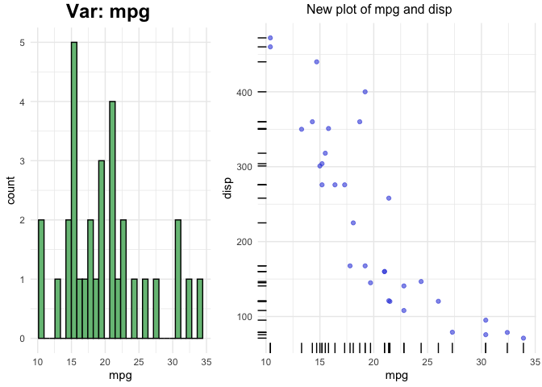

<!-- README.md is generated from README.Rmd. Please edit that file -->

# analyzer

<!-- badges: start -->

<!-- badges: end -->

The goal of analyzer is to make data analysis easy and accessible to
everyone by automatically performing the common tasks involved in data
analysis. With one command this can also create an R notebook (.rmd)
file and convert it into html or pdf file. The notebooks can also be
made interactive.

## Installation

You can install the released version of analyzer from
[CRAN](https://CRAN.R-project.org) with:

``` r
install.packages("analyzer")
```

And the development version from Github with:

``` r
# install.packages("devtools")
devtools::install_github("apurvpriyam/analyzer")
```

``` r
library(analyzer)
library(ggplot2)
```

## Example - Notebook

This is a basic example which shows how to solve a common problem. By
running the following command a notebook can be generated:

``` r
GenerateReport(dtpath = "mtcars.csv",
               catVars = c("cyl", "vs", "am", "gear"),
               yvar = "vs", model = "binClass",
               output_format = 'html_document',
               title = "Report", 
               output_dir = tempdir(),
               interactive.plots = FALSE)
```

In the above command we are asking to generate an HTML file
(output\_format = ‘html\_document’) for the data **mtcars.csv** stored
in the working directory (dtpath = “mtcars.csv”). We defined the
variables (“cyl”, “vs”, “am”, “gear”) as categorical through the
parameter ‘catVars’ and variable “vs” as the dependent variable.

For more details on other parameters, look into the help of
**GenerateReport** function. The generated notebook will have all the
relevant code snippets for this particular data along with the outputs.
The notebook can be used as a reference and modified as required.

## Example - Explaining variables

**analyzer** provides a method named **explainer** which can be used to
explain any vector or data.frame in detail. This function prints the
summary which also includes box plot (continuous vector) and frequency
plot (categorical vector).

``` r
# For a continuous vector
explainer(mtcars$mpg, quant.seq = c(0, 0.25, 0.5, 1),
          include.numeric = c("trimmed.means", "skewness", "kurtosis"))
#> mtcars$mpg (type: numeric)
#> ..........................
#>      distinct    missing    mean    sd    median    0%    25%    50%    100%    trimmed mean5%
#> 1          25          0   20.09  6.03      19.2  10.4  15.43   19.2    33.9             19.95
#>      skewness    kurtosis
#> 1        0.64        -0.2
#> Box plot:
#> |.................<==============*============>..........................................|
#> Legends: | min and max, <==  ==> IQR, * median
#> Potential outliers present in this variable
#> 
```

In above **explainer** we have asked to only give quantiles
corresponding to 0 (minimum), 0.25, 0.50 (median) and 1 (maximum)
probability. We also instructed the function to give extra statistics
like trimmed mean, skewness and kurtosis.

``` r
# For a categorical vector
explainer(as.factor(mtcars$cyl))
#> X (type: factor)
#> ................
#>  distinct missing
#>         3       0
#> 
#> Frequency table:
#>   Value Freq Proportion                                                
#> 1     4   11      0.344 |****************************............|(50%)
#> 2     6    7      0.219 |******************......................|(50%)
#> 3     8   14      0.438 |***********************************.....|(50%)
```

The percentage mentioned after the bars (50%) shows the maximum percent
for the bar plots. A bar of full length means 50%.

``` r
# For a complete data.frame
explainer(mtcars)
#> Data: mtcars
#> Type: data.frame
#> 
#> Number of columns: 11
#> Number of rows: 32
#> Number of distinct rows: 32
#> 
#> xxxxxxxxxxxxxxxxxxxxxxxxxxxxxxxxxxxxxxxxxxxxxxxxxxxxxxxxxxxxxxxxxxxxxxxxxxxxxxxxxxxxxxxxxxxxxxxxxxxx
#> 
#> mpg (type: numeric)
#> ...................
#>      distinct    missing    mean    sd    median    0%    20%    40%    60%    80%    100%
#> 1          25          0   20.09  6.03      19.2  10.4   15.2  17.92     21  24.08    33.9
#> Box plot:
#> |.................<==============*============>..........................................|
#> Legends: | min and max, <==  ==> IQR, * median
#> Potential outliers present in this variable
#> 
#> 
#> xxxxxxxxxxxxxxxxxxxxxxxxxxxxxxxxxxxxxxxxxxxxxxxxxxxxxxxxxxxxxxxxxxxxxxxxxxxxxxxxxxxxxxxxxxxxxxxxxxxx
#> 
#> cyl (type: numeric)
#> ...................
#>      distinct    missing    mean    sd    median    0%    20%    40%    60%    80%    100%
#> 1           3          0    6.19  1.79         6     4      4      6      8      8       8
#> Box plot:
#> |<============================================*============================================>|
#> Legends: | min and max, <==  ==> IQR, * median
#> 
#> Showing frequency table because variable has less distinct values:
#>   Value Freq Proportion                                                
#> 1     4   11      0.344 |****************************............|(50%)
#> 2     6    7      0.219 |******************......................|(50%)
#> 3     8   14      0.438 |***********************************.....|(50%)
#> 
#> xxxxxxxxxxxxxxxxxxxxxxxxxxxxxxxxxxxxxxxxxxxxxxxxxxxxxxxxxxxxxxxxxxxxxxxxxxxxxxxxxxxxxxxxxxxxxxxxxxxx
#> 
#> disp (type: numeric)
#> ....................
#>        distinct      missing      mean      sd      median      0%      20%      40%      60%
#> 1            27            0    230.72  123.94       196.3    71.1   120.14      160    275.8
#>        80%      100%
#> 1    350.8       472
#> Box plot:
#> |.........<================*============================>................................|
#> Legends: | min and max, <==  ==> IQR, * median
#> 
#> 
#> xxxxxxxxxxxxxxxxxxxxxxxxxxxxxxxxxxxxxxxxxxxxxxxxxxxxxxxxxxxxxxxxxxxxxxxxxxxxxxxxxxxxxxxxxxxxxxxxxxxx
#> 
#> hp (type: numeric)
#> ..................
#>       distinct     missing     mean     sd     median     0%     20%     40%     60%     80%
#> 1           22           0   146.69  68.56        123     52    93.4     110     165     200
#>       100%
#> 1      335
#> Box plot:
#> |............<========*=================>................................................|
#> Legends: | min and max, <==  ==> IQR, * median
#> Potential outliers present in this variable
#> 
#> 
#> xxxxxxxxxxxxxxxxxxxxxxxxxxxxxxxxxxxxxxxxxxxxxxxxxxxxxxxxxxxxxxxxxxxxxxxxxxxxxxxxxxxxxxxxxxxxxxxxxxxx
#> 
#> drat (type: numeric)
#> ....................
#>      distinct    missing    mean    sd    median    0%    20%    40%    60%    80%    100%
#> 1          22          0     3.6  0.53       3.7  2.76   3.07   3.35   3.82   4.05    4.93
#> Box plot:
#> |...........<=========================*========>.........................................|
#> Legends: | min and max, <==  ==> IQR, * median
#> 
#> 
#> xxxxxxxxxxxxxxxxxxxxxxxxxxxxxxxxxxxxxxxxxxxxxxxxxxxxxxxxxxxxxxxxxxxxxxxxxxxxxxxxxxxxxxxxxxxxxxxxxxxx
#> 
#> wt (type: numeric)
#> ..................
#>      distinct    missing    mean    sd    median    0%    20%    40%    60%    80%    100%
#> 1          29          0    3.22  0.98      3.33  1.51   2.35   3.16   3.44   3.77    5.42
#> Box plot:
#> |.......................<================*=====>.........................................|
#> Legends: | min and max, <==  ==> IQR, * median
#> Potential outliers present in this variable
#> 
#> 
#> xxxxxxxxxxxxxxxxxxxxxxxxxxxxxxxxxxxxxxxxxxxxxxxxxxxxxxxxxxxxxxxxxxxxxxxxxxxxxxxxxxxxxxxxxxxxxxxxxxxx
#> 
#> qsec (type: numeric)
#> ....................
#>      distinct    missing    mean    sd    median    0%    20%    40%    60%    80%    100%
#> 1          30          0   17.85  1.79     17.71  14.5  16.73  17.34  18.18  19.33    22.9
#> Box plot:
#> |........................<=======*============>..........................................|
#> Legends: | min and max, <==  ==> IQR, * median
#> Potential outliers present in this variable
#> 
#> 
#> xxxxxxxxxxxxxxxxxxxxxxxxxxxxxxxxxxxxxxxxxxxxxxxxxxxxxxxxxxxxxxxxxxxxxxxxxxxxxxxxxxxxxxxxxxxxxxxxxxxx
#> 
#> vs (type: numeric)
#> ..................
#>     distinct   missing   mean   sd   median   0%   20%   40%   60%   80%   100%
#> 1          2         0   0.44  0.5        0    0     0     0     1     1      1
#> Box plot:
#> No boxplot for this as unique values are < 3.
#> Showing frequency table because variable has less distinct values:
#>   Value Freq Proportion                                                
#> 1     0   18      0.562 |******************************..........|(75%)
#> 2     1   14      0.438 |***********************.................|(75%)
#> 
#> xxxxxxxxxxxxxxxxxxxxxxxxxxxxxxxxxxxxxxxxxxxxxxxxxxxxxxxxxxxxxxxxxxxxxxxxxxxxxxxxxxxxxxxxxxxxxxxxxxxx
#> 
#> am (type: numeric)
#> ..................
#>     distinct   missing   mean   sd   median   0%   20%   40%   60%   80%   100%
#> 1          2         0   0.41  0.5        0    0     0     0   0.6     1      1
#> Box plot:
#> No boxplot for this as unique values are < 3.
#> Showing frequency table because variable has less distinct values:
#>   Value Freq Proportion                                                
#> 1     0   19      0.594 |********************************........|(75%)
#> 2     1   13      0.406 |**********************..................|(75%)
#> 
#> xxxxxxxxxxxxxxxxxxxxxxxxxxxxxxxxxxxxxxxxxxxxxxxxxxxxxxxxxxxxxxxxxxxxxxxxxxxxxxxxxxxxxxxxxxxxxxxxxxxx
#> 
#> gear (type: numeric)
#> ....................
#>      distinct    missing    mean    sd    median    0%    20%    40%    60%    80%    100%
#> 1           3          0    3.69  0.74         4     3      3      3      4      4       5
#> Box plot:
#> |<============================================*>............................................|
#> Legends: | min and max, <==  ==> IQR, * median
#> 
#> Showing frequency table because variable has less distinct values:
#>   Value Freq Proportion                                                
#> 1     3   15      0.469 |**************************************..|(50%)
#> 2     4   12      0.375 |******************************..........|(50%)
#> 3     5    5      0.156 |************............................|(50%)
#> 
#> xxxxxxxxxxxxxxxxxxxxxxxxxxxxxxxxxxxxxxxxxxxxxxxxxxxxxxxxxxxxxxxxxxxxxxxxxxxxxxxxxxxxxxxxxxxxxxxxxxxx
#> 
#> carb (type: numeric)
#> ....................
#>      distinct    missing    mean    sd    median    0%    20%    40%    60%    80%    100%
#> 1           6          0    2.81  1.62         2     1    1.2      2      3      4       8
#> Box plot:
#> |...........<*=========================>..................................................|
#> Legends: | min and max, <==  ==> IQR, * median
#> Potential outliers present in this variable
#> 
#> Showing frequency table because variable has less distinct values:
#>   Value Freq Proportion                                                
#> 1     1    7      0.219 |******************......................|(50%)
#> 2     2   10      0.312 |*************************...............|(50%)
#> 3     3    3      0.094 |********................................|(50%)
#> 4     4   10      0.312 |*************************...............|(50%)
#> 5     6    1      0.031 |**......................................|(50%)
#> 6     8    1      0.031 |**......................................|(50%)
#> 
#> xxxxxxxxxxxxxxxxxxxxxxxxxxxxxxxxxxxxxxxxxxxxxxxxxxxxxxxxxxxxxxxxxxxxxxxxxxxxxxxxxxxxxxxxxxxxxxxxxxxx
#> 
```

## Example - Plots

**analyzer** can also be used to automatically generate plots for all
the columns in the data. If the data has a dependent (response) variable
pass it through the **yvar** argument and its type through **yclass**
argument.

``` r
# Simple plot for one variable
p <- plottr(mtcars$mpg)
plot(p$x)
```


``` r
# default plots for all the variables in mtcars
p <- plottr(mtcars, yvar = "disp", yclass = "numeric")
plot(p$mpg)
```


The left plot is the univariate plot of ‘mpg’. Right plot is bivariate
plot with the dependent variable ‘disp’.

External functions can be used to create custom plots. the function
**plottr** can take 6 functions for plots of different types of
variables. Look into the help of plottr for more details.

Below function updates the right side of plot which is the bivariate
plot between the dependent and independent variable (both continuous).

``` r
# Define a function for plot for continuous independent and Continuous dependent variables
custom_plot_for_continuous_vars <- function(dat, xname, yname, ...) {
  
  xyplot <- ggplot(dat, aes_string(x=xname, y=yname)) +
    geom_point(alpha = 0.6, color = "#3c4fde") + geom_rug() +
    theme_minimal()
  xyplot <- gridExtra::arrangeGrob(xyplot,
                                   top = paste0("New plot of ",
                                                xname, " and ", yname)
  )

  return(xyplot)
  
}
```

The parameters dat, xname, yname and … must be present. Additional
arguments can be added.

``` r
p <- plottr(mtcars, yvar = "disp", yclass = "numeric", 
            FUN3 = custom_plot_for_continuous_vars)
plot(p$mpg)
```


FUN3 argument is used for generating plots for Continuous independent
and Continuous dependent variables. This will update the right plot.
Left (Univariate) plots can also be changed by using FUN1 (for
Continous) and FUN2 (for Categorical) variables.

``` r
# Define a function for plot for continuous independent and Continuous dependent variables
custom_plot2 <- function(dat, xname, ...) {
  
  # histogram
  p1 <- ggplot(dat, aes_string(x=xname)) +
    geom_histogram(fill="#77bf85", color = "black") +
    theme_minimal()

  return(p1)
  
}
```

``` r
p <- plottr(mtcars, yvar = "disp", yclass = "numeric",
            FUN1 = custom_plot2, 
            FUN3 = custom_plot_for_continuous_vars)
plot(p$mpg)
```



## Example - Correlation and Association

**analyzer** can also be used to get the measure of association between
the variables for the complete dataset. For two continuous variables it
can find the **pearson, spearman and kendall correlation** based on
normality assumption. For two categorical variables it can be used to
get the **Chi Square** p-value or **Cramer’s V** value. Between one
continuous and one categorical **analyzer** can use **t-test,
Mann-Whitney, Kruskal-Wallis and ANOVA test**. The association test
depends on multiple criteria including number of unique values in
categorical feature, normality test and equal variance test. Equal
variance test, in turn, is done by **Bartlett’s test** or
**Fligner-Killeen** test based on normality assumption. Normality test
can also be performed using multiple tests (see the normality test
section).

The most simple use is:

``` r
corr_all <- association(mtcars, categorical = c('cyl', 'vs', 'am', 'gear'), normality_test_method = 'ks')
```

In above example we have defined ‘cyl’, ‘vs’, ‘am’, ‘gear’ variables as
categorical and set the **Kolmogorov-Smirnov test** as the normality
test method. This returns a list of 6 data.frames. The function selects
the method automatically based on different normality and equal variance
tests. The selected methods can be seen by

``` r
corr_all$method_used
#>                 mpg            cyl           disp             hp           drat             wt
#> mpg         pearson Kruskal-Wallis        pearson        pearson        pearson        pearson
#> cyl  Kruskal-Wallis     Chi Square Kruskal-Wallis Kruskal-Wallis Kruskal-Wallis Kruskal-Wallis
#> disp        pearson Kruskal-Wallis        pearson        pearson        pearson        pearson
#> hp          pearson Kruskal-Wallis        pearson        pearson        pearson        pearson
#> drat        pearson Kruskal-Wallis        pearson        pearson        pearson        pearson
#> wt          pearson Kruskal-Wallis        pearson        pearson        pearson        pearson
#> qsec        pearson Kruskal-Wallis        pearson        pearson        pearson        pearson
#> vs     Mann-Whitney     Chi Square   Mann-Whitney   Mann-Whitney   Mann-Whitney   Mann-Whitney
#> am     Mann-Whitney     Chi Square   Mann-Whitney   Mann-Whitney   Mann-Whitney   Mann-Whitney
#> gear Kruskal-Wallis     Chi Square Kruskal-Wallis Kruskal-Wallis Kruskal-Wallis Kruskal-Wallis
#> carb        pearson Kruskal-Wallis        pearson        pearson        pearson        pearson
#>                qsec           vs           am           gear           carb
#> mpg         pearson Mann-Whitney Mann-Whitney Kruskal-Wallis        pearson
#> cyl  Kruskal-Wallis   Chi Square   Chi Square     Chi Square Kruskal-Wallis
#> disp        pearson Mann-Whitney Mann-Whitney Kruskal-Wallis        pearson
#> hp          pearson Mann-Whitney Mann-Whitney Kruskal-Wallis        pearson
#> drat        pearson Mann-Whitney Mann-Whitney Kruskal-Wallis        pearson
#> wt          pearson Mann-Whitney Mann-Whitney Kruskal-Wallis        pearson
#> qsec        pearson Mann-Whitney Mann-Whitney Kruskal-Wallis        pearson
#> vs     Mann-Whitney   Chi Square   Chi Square     Chi Square   Mann-Whitney
#> am     Mann-Whitney   Chi Square   Chi Square     Chi Square   Mann-Whitney
#> gear Kruskal-Wallis   Chi Square   Chi Square     Chi Square Kruskal-Wallis
#> carb        pearson Mann-Whitney Mann-Whitney Kruskal-Wallis        pearson
```

The methods for association can be changed by using the method1 (between
2 continuous variable) or method3 (between continuous and categorical
variables). The default is ‘auto’ for automatic selection. Method can
also be changed at the variables pair level by using **methodMats**
argument in following way. Define a data.frame in following way and pass
it through methodMats:

``` r
corr_all$method_used
#>                 mpg            cyl           disp             hp           drat             wt
#> mpg         pearson Kruskal-Wallis        pearson        pearson        pearson        pearson
#> cyl  Kruskal-Wallis     Chi Square Kruskal-Wallis Kruskal-Wallis Kruskal-Wallis Kruskal-Wallis
#> disp        pearson Kruskal-Wallis        pearson        pearson        pearson        pearson
#> hp          pearson Kruskal-Wallis        pearson        pearson        pearson        pearson
#> drat        pearson Kruskal-Wallis        pearson        pearson        pearson        pearson
#> wt          pearson Kruskal-Wallis        pearson        pearson        pearson        pearson
#> qsec        pearson Kruskal-Wallis        pearson        pearson        pearson        pearson
#> vs     Mann-Whitney     Chi Square   Mann-Whitney   Mann-Whitney   Mann-Whitney   Mann-Whitney
#> am     Mann-Whitney     Chi Square   Mann-Whitney   Mann-Whitney   Mann-Whitney   Mann-Whitney
#> gear Kruskal-Wallis     Chi Square Kruskal-Wallis Kruskal-Wallis Kruskal-Wallis Kruskal-Wallis
#> carb        pearson Kruskal-Wallis        pearson        pearson        pearson        pearson
#>                qsec           vs           am           gear           carb
#> mpg         pearson Mann-Whitney Mann-Whitney Kruskal-Wallis        pearson
#> cyl  Kruskal-Wallis   Chi Square   Chi Square     Chi Square Kruskal-Wallis
#> disp        pearson Mann-Whitney Mann-Whitney Kruskal-Wallis        pearson
#> hp          pearson Mann-Whitney Mann-Whitney Kruskal-Wallis        pearson
#> drat        pearson Mann-Whitney Mann-Whitney Kruskal-Wallis        pearson
#> wt          pearson Mann-Whitney Mann-Whitney Kruskal-Wallis        pearson
#> qsec        pearson Mann-Whitney Mann-Whitney Kruskal-Wallis        pearson
#> vs     Mann-Whitney   Chi Square   Chi Square     Chi Square   Mann-Whitney
#> am     Mann-Whitney   Chi Square   Chi Square     Chi Square   Mann-Whitney
#> gear Kruskal-Wallis   Chi Square   Chi Square     Chi Square Kruskal-Wallis
#> carb        pearson Mann-Whitney Mann-Whitney Kruskal-Wallis        pearson
```

This data.frame can take values like the one returned originally:

  - between continuous-continuous variables (“auto”, “pearson”,
    “kendall”, “spearman”)
  - between continuous-categorical variables (“auto”, “t-test”, “ANOVA”,
    “Mann-Whitney”, “Kruskal-Wallis”)
  - between categorical-categorical variables can be anything

But its advisable to pass values like below because t-test and ANOVA are
both for parametric test but depends on number of unique values in the
categorical variable. If ‘parametric’ is used instead of ‘ANOVA’ or
‘t-test’ then function identifies between ‘ANOVA’ or ‘t-test’
automatically.

  - between continuous-continuous variables (“auto”, “pearson”,
    “kendall”, “spearman”)
  - between continuous-categorical variables (“auto”, “parametric”,
    “non-parametric”)
  - between categorical-categorical variables can be anything

## Example - Normality test

**analyzer** also gives the function to do normality test using three
different methods:

  - Shapiro-Wilk test
  - Anderson-Darling test
  - Kolmogorov-Smirnov test

<!-- end list -->

``` r
norm_test_fun(mtcars$mpg, method = "anderson")
#> 
#>  Anderson-Darling normality test
#> 
#> data:  x
#> A = 0.57968, p-value = 0.1207
```

## Example - Analyzing merge

**analyzer** can be used to get the summary of data pre and post merge.

``` r
A <- data.frame(id = c("A", "A", "B", "D", "B"),
                valA = c(30, 83, 45, 2, 58))

B <- data.frame(id = c("A", "C", "A", "B", "C", "C"),
                valB = c(10, 20, 30, 40, 50, 60))


merged <- mergeAnalyzer(A, B, allow.cartesian = T)
```

Above print shows that left data (**A**) has sum of **valA column =
218**. After merge it became **329**, which is **1.51** times (shown in
column **remainingWRTx**). Similarly, right data (**B**) has sum of valB
column = 210. After merge it became **160** which is **0.76** of
original sum (shown in column **remainingWRTy**). First row shows the
number of rows. in left (**A**), right (**B**) and merged data.
